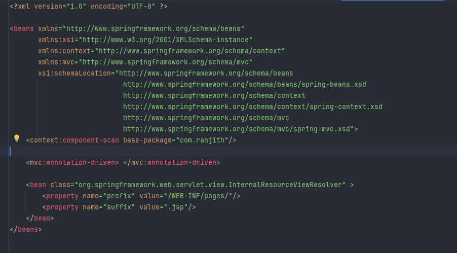
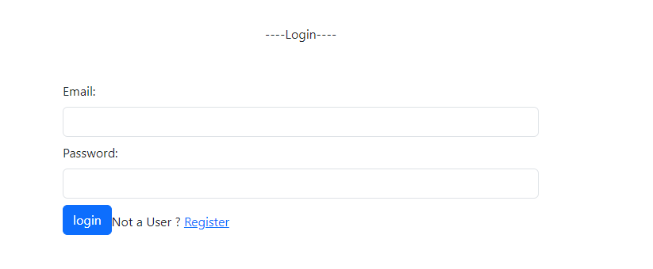
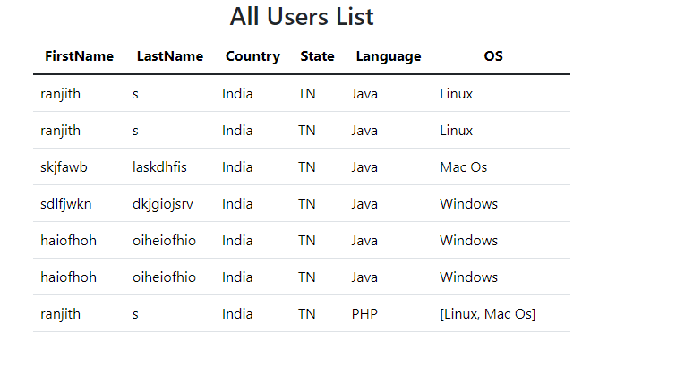

# LOGIN AND Register USING SPRING-MVC
This project is developed using JAVA V-17.0.8 and Spring-MVC.

Text editor used: INTELLIJ.

Project: Maven based project.
## 🛠 Skills
------------      
    - Spring MVC
    - Java
    - HTML
    - Bootstrap
    - JDBC
    - MYSQL
## OverView of the project:
---------------------------
    Here, user can login into application details of users with their credentials.
    
    If, You are new user you can register using the option provided.
## Project Structure
⏩Models:
   - User
⏩Controller
   - RegisterController
   - UserController
   
⏩Dao
   - User Dao

⏩JSP files
   - showusers.jsp
   - index.jsp 
   - register.jsp
## Dependencies Used
1. Javax servlet
2. Jstl
3. Sql connector
4. Springboot framework
---------------------------------
## Screenshoots
Bean Creation :

Login:

Home:

Register:

 
